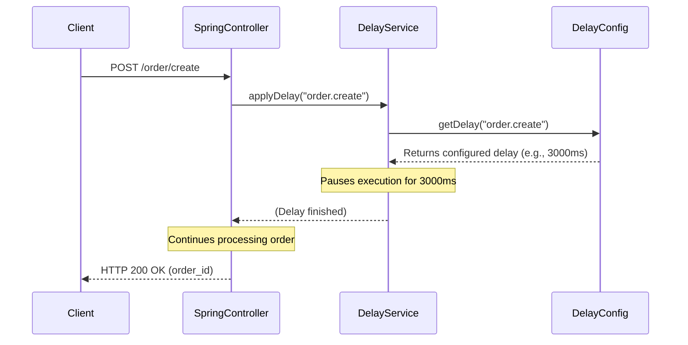

# Chapter 4: Configurable Delays

Welcome back to the `practicalwork` project tutorial! In the [previous chapter](03_session_management_.md), we learned about **Session Management** – how our application keeps track of individual users with a temporary "ticket" called a Session ID. Now, let's explore a powerful feature that makes our "mock" application feel more like a real-world system: **Configurable Delays**.

### Why Do We Need Configurable Delays?

Imagine building a mobile app that talks to our `practicalwork` backend. In the real world, when your app asks for a list of products or tries to create an order, the response isn't always instant. There can be network lag, server processing time, or database queries that take a moment. If our `practicalwork` application always responds immediately, your mobile app might never encounter these real-world "waiting" scenarios during testing.

The problem **Configurable Delays** solves is allowing us to *simulate* these real-world waiting times. Since `practicalwork` is a "mock" or "stub" project, it doesn't do complex, time-consuming tasks like a real e-commerce system would. By adding configurable delays, we can artificially slow down specific parts of our application.

This is super useful for developers because they can test:
*   How their client applications (mobile apps, web browsers) behave when responses are slow.
*   If their loading spinners work correctly.
*   If their app handles timeouts gracefully.
*   The user experience under different performance conditions.

Think of it as an adjustable "wait timer" that we can set for various operations within our application.

### Key Concepts of Configurable Delays

To achieve this, our `practicalwork` project uses two main components:

| Component        | Role (What it does)                                               | Analogy                                     |
| :--------------- | :---------------------------------------------------------------- | :------------------------------------------ |
| `DelayConfig`    | Defines *how long* to wait for *which specific operation*.       | The **rulebook** or **schedule** for delays |
| `DelayService`   | Actively *pauses* the application's execution for the specified time. | The **waiter** who holds things up         |

Let's see how they work together.

### How to Use: Setting Up Delays

The easiest way to configure delays in our `practicalwork` project is through the `application.yml` file, which is where we keep many of our application's settings.

You can specify a `default` delay that applies to all operations, and then override it for specific endpoints like `session.create` or `order.getProducts`.

Here’s how you might set up delays in `src/main/resources/application.yml`:

```yaml
# File: src/main/resources/application.yml

# ... other settings ...

response:
  delay:
    default: 0                 # Default delay for any operation not specifically listed (in milliseconds)
    session:
      create: 500              # Wait 500 ms when creating a session
      delete: 500              # Wait 500 ms when deleting a session
      check: 0                 # No delay when checking a session
    order:
      create: 3000             # Wait 3000 ms (3 seconds) when creating an order
      getProducts: 1500        # Wait 1500 ms (1.5 seconds) when getting products
      getOrder: 1500           # Wait 1500 ms (1.5 seconds) when getting a specific order
```
*   The `response.delay` section is where all our delay settings live.
*   `default: 0` means that if we don't specify a delay for a particular operation, it will default to no delay.
*   Under `session` and `order`, we can set specific delays for operations within those categories. For example, `create: 3000` under `order` means that any call to create an order will intentionally wait for 3 seconds before responding.

These settings are read by our `DelayConfig` component when the application starts up.

#### What Happens When a Delay is Active?

Let's say you've configured `order.create: 3000`. When a client sends a `POST` request to `/order/create`, the application will:
1.  Receive the request.
2.  Before processing the order, it will pause for 3000 milliseconds (3 seconds).
3.  After the pause, it will then create the order (as described in [Order Processing](02_order_processing_.md)).
4.  Finally, it will send the response back to the client.

From the client's perspective, the request just took 3 seconds longer than it would have without the delay! This allows you to test how your UI handles a slow order creation process.

### Inside the `DelayService`: How it Works

Now, let's look at how this waiting mechanism is implemented within our application.

#### High-Level Flow of a Delayed Request

Let's trace what happens when you call an endpoint like `/order/create` with a delay configured:

1.  **Client Sends Request**: Your browser or app sends a `POST` request to `/order/create`.
2.  **`SpringController` Receives**: The `SpringController` (our REST API endpoint from [Chapter 1: REST API Endpoints](01_rest_api_endpoints_.md)) receives the request.
3.  **Controller Asks for Delay**: The `SpringController` immediately calls the `DelayService` and tells it which operation is about to happen (e.g., "order.create").
4.  **`DelayService` Checks `DelayConfig`**: The `DelayService` looks at its "rulebook" (`DelayConfig`) to find the configured delay for "order.create".
5.  **`DelayService` Pauses**: If a delay is configured (e.g., 3000ms), the `DelayService` tells the application to *sleep* for that duration.
6.  **Processing Resumes**: After the sleep, the `DelayService` returns control to the `SpringController`.
7.  **Order Processing Continues**: The `SpringController` then proceeds with validating the session and creating the order via `OrderService` (as explained in [Order Processing](02_order_processing_.md) and [Session Management](03_session_management_.md)).
8.  **Response Sent Back**: Finally, the application sends the response to the client.

Here's a simple diagram illustrating this flow:



#### Diving into the Code Implementation

Let's look at the actual code that makes this happen.

##### 1. The `DelayConfig` Model

This class directly maps to the `response.delay` section in your `application.yml`. It's like a Java representation of your delay rulebook.

```java
// File: src/main/java/BellSpring/model/DelayConfig.java

package BellSpring.model;

import lombok.Data;
import org.springframework.boot.context.properties.ConfigurationProperties;
import org.springframework.stereotype.Component;

@Data
@Component
@ConfigurationProperties(prefix = "response.delay") // Links this class to 'response.delay' in YAML
public class DelayConfig {
    private long defaultDelay; // Corresponds to 'response.delay.default'
    private Session session = new Session(); // Holds session-specific delays
    private Order order = new Order();       // Holds order-specific delays

    @Data
    public static class Session {
        private long create; // Corresponds to 'response.delay.session.create'
        private long delete;
        private long check;
    }

    @Data
    public static class Order {
        private long create; // Corresponds to 'response.delay.order.create'
        private long getProducts;
        private long getOrder;
    }
}
```
*   `@ConfigurationProperties(prefix = "response.delay")`: This is a special Spring Boot annotation that tells the application to automatically fill the fields of this `DelayConfig` object with values from your `application.yml` under the `response.delay` section.
*   `@Data` (from Lombok library): This automatically creates common methods like `getters` and `setters` for all fields, making the code cleaner.
*   The `Session` and `Order` inner classes help organize the delays by category, matching the structure in `application.yml`.

##### 2. The `DelayService`

This is the "waiter" component that interprets the `DelayConfig` and actually performs the pause.

```java
// File: src/main/java/BellSpring/service/DelayService.java

package BellSpring.service;

import BellSpring.model.DelayConfig;
import lombok.RequiredArgsConstructor;
import org.springframework.stereotype.Service;

import java.util.concurrent.TimeUnit; // Used for pausing execution

@Service
@RequiredArgsConstructor
public class DelayService {

    private final DelayConfig delayConfig; // Automatically gets our configured delays

    public void applyDelay(String endpoint) {
        long delay = getDelay(endpoint); // Find out how long to wait for this 'endpoint'
        if (delay > 0) { // Only pause if the delay is greater than 0
            try {
                TimeUnit.MILLISECONDS.sleep(delay); // This line makes the current thread "sleep"
            } catch (InterruptedException e) {
                // If something tries to interrupt our waiting, we clean up
                Thread.currentThread().interrupt();
            }
        }
    }

    private long getDelay(String endpoint) {
        // This method looks up the correct delay based on the 'endpoint' string
        return switch (endpoint) {
            case "session.create" -> delayConfig.getSession().getCreate();
            case "session.delete" -> delayConfig.getSession().getDelete();
            case "session.check" -> delayConfig.getSession().getCheck();
            case "order.create" -> delayConfig.getOrder().getCreate();
            case "order.getProducts" -> delayConfig.getOrder().getGetProducts();
            case "order.getOrder" -> delayConfig.getOrder().getGetOrder();
            default -> delayConfig.getDefaultDelay(); // If no specific delay, use the default
        };
    }

    public DelayConfig getConfig() {
        return delayConfig; // Allows other parts to read the current delay settings
    }
}
```
*   `@Service`: Marks this class as a Spring service, meaning Spring will manage it and allow it to be injected into other components.
*   `private final DelayConfig delayConfig;`: Spring automatically injects the `DelayConfig` object (which was populated from `application.yml`) into our `DelayService`.
*   `applyDelay(String endpoint)`: This is the main method that other parts of the application call. It takes a string (like "order.create") to identify which operation is requesting a delay.
*   `getDelay(String endpoint)`: This helper method uses a `switch` statement to find the correct delay value from the `delayConfig` object.
*   `TimeUnit.MILLISECONDS.sleep(delay)`: This is the core line! It tells the program to pause its execution for the specified number of milliseconds. This is how the "wait timer" works.

##### 3. Applying Delays in the `SpringController`

Finally, we need to tell our endpoints to *use* the `DelayService`. This is done by simply calling `delayService.applyDelay()` at the beginning of the relevant endpoint methods.

```java
// File: src/main/java/BellSpring/controller/SpringController.java

// ... imports and class definition ...

@RestController
@RequiredArgsConstructor
public class SpringController {

    // ... other services ...
    private final DelayService delayService; // Inject our DelayService

    @PostMapping("/order/create")
    public ResponseEntity<?> createOrder(@RequestHeader("Session-ID") String sessionId,
                                             @RequestBody Map<String, Object> request) {
        // --- This is where the delay is applied! ---
        delayService.applyDelay("order.create"); // Tell DelayService to wait for "order.create"

        // Step 1: Validate the user's session
        if (!sessionService.isValidSession(sessionId)) {
            return ResponseEntity.status(401).body("Unauthorized: Invalid session");
        }
        // ... rest of the order creation logic ...
        return null; // Simplified
    }

    @GetMapping("/order/getProducts")
    public ResponseEntity<?> getProducts(@RequestHeader("Session-ID") String sessionId) {
        // --- Apply delay here for getting products ---
        delayService.applyDelay("order.getProducts");

        if (!sessionService.isValidSession(sessionId)) {
            return ResponseEntity.status(401).body("Unauthorized: Invalid session");
        }
        // ... return products ...
        return null; // Simplified
    }
}
```
*   `private final DelayService delayService;`: The `DelayService` is injected into the `SpringController` so that the controller can use its methods.
*   `delayService.applyDelay("order.create");`: This line is strategically placed at the beginning of the `createOrder` method. When a request comes in, this is one of the very first things that happens *after* the request arrives at the endpoint, causing the program to pause if a delay is configured.

### Conclusion

In this chapter, we've learned about **Configurable Delays**, a simple yet powerful feature in our `practicalwork` project. We've seen how `DelayConfig` acts as a rulebook for specifying wait times in `application.yml`, and how `DelayService` actively pauses the application using `TimeUnit.MILLISECONDS.sleep()` to simulate real-world network and processing latency. By strategically placing `delayService.applyDelay()` calls in our REST API endpoints, we can easily test how client applications behave under various performance conditions.

Next, we'll dive into another critical part of our application: [Kafka Messaging](05_kafka_messaging_.md), which allows different parts of our system to communicate reliably and efficiently using messages.

---

<sub><sup>Generated by [AI Codebase Knowledge Builder](https://github.com/The-Pocket/Tutorial-Codebase-Knowledge).</sup></sub> <sub><sup>**References**: [[1]](https://github.com/avgystin/practicalwork/blob/71096d4adfc15ec4fc4942c8c3cefe26364d3a19/src/main/java/BellSpring/controller/DelayController.java), [[2]](https://github.com/avgystin/practicalwork/blob/71096d4adfc15ec4fc4942c8c3cefe26364d3a19/src/main/java/BellSpring/controller/SpringController.java), [[3]](https://github.com/avgystin/practicalwork/blob/71096d4adfc15ec4fc4942c8c3cefe26364d3a19/src/main/java/BellSpring/model/DelayConfig.java), [[4]](https://github.com/avgystin/practicalwork/blob/71096d4adfc15ec4fc4942c8c3cefe26364d3a19/src/main/java/BellSpring/service/DelayService.java), [[5]](https://github.com/avgystin/practicalwork/blob/71096d4adfc15ec4fc4942c8c3cefe26364d3a19/src/main/resources/application.yml)</sup></sub>