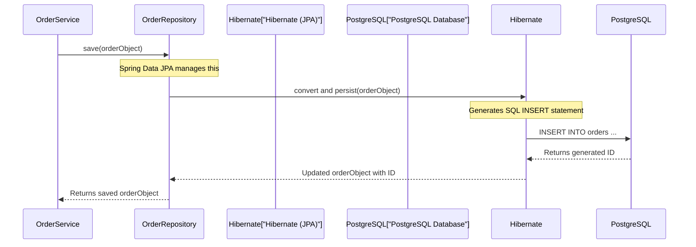

# Chapter 6: Persistence Layer (JPA/Hibernate)

Welcome back to the `practicalwork` project tutorial! In our [previous chapter](05_kafka_messaging_.md), we explored **Kafka Messaging**, where we saw how our application uses a "postal service" to send messages asynchronously. While Kafka ensures messages are delivered reliably, it's primarily for *temporary storage and communication*. But what happens when we need to remember all those orders our customers placed, or every message sent to Kafka, permanently? What if our application restarts? All the information held only in the computer's temporary memory (RAM) would be lost!

This is where the **Persistence Layer** comes in. Think of it as our application's **long-term memory** or its **filing cabinet**. It's the dedicated part of our system responsible for storing and retrieving data permanently, ensuring that crucial information like customer orders and received messages are never lost, even if the application shuts down and restarts.

### Why Do We Need a Persistence Layer?

Imagine our `practicalwork` application is an online store. When a customer successfully creates an order (as we saw in [Order Processing](02_order_processing_.md)), that order needs to be saved somewhere safe. If we only kept it in the application's immediate memory, restarting the server would mean all orders disappear! The same goes for the messages our [Kafka Messaging](05_kafka_messaging_.md) consumer receives; we want to log them for auditing or future use.

The problem **Persistence Layer** solves is providing a way to durably store application data. It allows us to:

1.  **Save data:** Take Java objects (like an `Order` or `MessageEntity`) and write them to a database.
2.  **Retrieve data:** Fetch those objects back from the database when needed.
3.  **Update data:** Modify existing data in the database.
4.  **Delete data:** Remove data from the database.

All of this happens by interacting with a **database**, specifically **PostgreSQL** in our `practicalwork` project.

**Central Use Case:** Our primary goal for the persistence layer is to permanently store `Order` objects created through the `/order/create` endpoint and `MessageEntity` objects received by our Kafka consumer.

### Key Concepts of the Persistence Layer

Working directly with databases can be complex, often involving writing intricate SQL queries (like `INSERT INTO orders ...` or `SELECT * FROM messages WHERE id = 123`). To make this easier and more "Java-friendly," our application uses some powerful tools:

| Concept         | Role (What it does)                                               | Analogy                                   |
| :-------------- | :---------------------------------------------------------------- | :---------------------------------------- |
| **Database**    | The physical storage where data lives permanently (e.g., PostgreSQL). | The **filing cabinet** itself.           |
| **Entity**      | A plain Java object that represents a row in a database table.     | A **pre-printed form** in the cabinet.   |
| **JPA (Java Persistence API)** | A *standard* for Java applications to manage data. It defines *how* to interact with databases using Java objects. | The **set of rules** for filing and retrieving forms. |
| **Hibernate**   | A popular *implementation* of the JPA standard. It does the actual work of translating Java objects to SQL and vice-versa. | The **experienced clerk** who knows how to follow JPA rules and interact with the cabinet. |
| **Repository (Spring Data JPA)** | A simplified "data manager" interface that lets us perform common database operations using simple method calls (like `save()` or `findById()`) without writing any SQL ourselves. | The **super-efficient assistant** who handles all filing requests by simply calling out commands. |

### How to Use: Saving and Retrieving Data Easily

The beauty of JPA/Hibernate, especially with Spring Data JPA, is that you rarely write SQL. Instead, you work with Java objects and simple methods.

Let's revisit our [Order Processing](02_order_processing_.md) and [Kafka Messaging](05_kafka_messaging_.md) to see how they use the persistence layer.

#### Saving an Order

Remember how the `OrderService` creates an `Order` object? Instead of directly writing SQL, it just asks the `OrderRepository` to save it:

```java
// File: src/main/java/BellSpring/service/OrderService.java (simplified)

// ... inside OrderService class ...

@Service
@RequiredArgsConstructor
public class OrderService {

    private final OrderRepository orderRepository; // Our order data manager
    // ... other services ...

    public Order createOrder(String sessionId, String productName, Integer quantity) {
        // ... (product price lookup, total calculation, create Order object) ...

        Order order = new Order();
        order.setSessionId(sessionId);
        order.setProductName(productName);
        // ... set other order details ...

        // This is where we save the Order object to the database!
        return orderRepository.save(order); // <-- Simple call, no SQL needed!
    }
}
```
*   `orderRepository.save(order)`: This single line is all it takes! The `OrderRepository`, powered by Spring Data JPA and Hibernate, automatically translates this `Order` Java object into an `INSERT` SQL statement and executes it against the PostgreSQL database.

**What happens:**
*   **Input:** A fully prepared `Order` Java object.
*   **Output:** The same `Order` object, but now it has its unique `id` (primary key) filled in by the database, confirming it's saved.

#### Saving a Message Entity

Similarly, our `KafkaConsumer` receives messages from Kafka and needs to store them permanently.

```java
// File: src/main/java/BellSpring/service/KafkaConsumer.java (simplified)

// ... inside KafkaConsumer class ...

@Component
@RequiredArgsConstructor
public class KafkaConsumer {

    private final MessageRepository messageRepository; // Our message data manager

    @KafkaListener(topics = "postedmessages", groupId = "my-group")
    public void listen(String message) {
        System.out.println("Received message: " + message);

        MessageEntity entity = new MessageEntity();
        entity.setContent(message);

        // Save the MessageEntity object to the database!
        messageRepository.save(entity); // <-- Another simple call!

        // ... logging ...
    }
}
```
*   `messageRepository.save(entity)`: Just like with orders, this command tells the `MessageRepository` to save the `MessageEntity` into its corresponding database table.

**What happens:**
*   **Input:** A `MessageEntity` Java object with its content.
*   **Output:** The `MessageEntity` object, now with an `id` from the database.

### Internal Implementation: How it Works Under the Hood

Let's peel back the layers to see how this magic happens.

#### High-Level Flow for Saving Data

When an application calls `repository.save(entity)`, here's what happens:

1.  **`OrderService` (or `KafkaConsumer`)**: It creates a Java object (`Order` or `MessageEntity`) and calls the `save()` method on its corresponding `Repository`.
2.  **`OrderRepository` (or `MessageRepository`)**: This is an interface provided by Spring Data JPA. Spring automatically creates the actual code for this interface behind the scenes.
3.  **Hibernate (JPA Implementation)**: Hibernate takes the Java object and uses the special annotations (like `@Entity`, `@Table`, `@Column`) on the object to figure out which database table and columns it corresponds to. It then generates the appropriate SQL `INSERT` or `UPDATE` statements.
4.  **PostgreSQL Database**: Hibernate sends this SQL to the PostgreSQL database. The database executes the SQL, stores the data, and returns any generated primary keys (like the `id`).
5.  **Return**: The saved object (with its database ID) is returned to the service.

Here's a sequence diagram illustrating this flow:



#### 1. Defining Your Data Structure: Entities

First, we need to tell JPA how our Java objects map to database tables. This is done using special annotations on our `Order` and `MessageEntity` classes.

**`MessageEntity.java`:**

```java
// File: src/main/java/BellSpring/model/MessageEntity.java

package BellSpring.model;

import jakarta.persistence.*; // Important JPA annotations
import lombok.Data;
import lombok.NoArgsConstructor;

@Entity // <-- Tells JPA: "This class maps to a database table!"
@Table(name = "messages") // <-- Specifies the actual table name in the DB
@Data // From Lombok, automatically creates getters/setters
@NoArgsConstructor
public class MessageEntity {
    @Id // <-- Marks this field as the Primary Key (unique identifier)
    @GeneratedValue(strategy = GenerationType.IDENTITY) // <-- DB auto-generates ID
    private Long id;

    @Column(name = "content") // <-- Maps this field to the 'content' column in the DB
    private String content;
}
```
*   `@Entity`: This is the most important annotation. It tells Hibernate (our JPA implementation) that `MessageEntity` is a special class whose objects should be saved to and loaded from the database.
*   `@Table(name = "messages")`: Specifies that this entity maps to a table named `messages` in our PostgreSQL database.
*   `@Id`: Marks the `id` field as the primary key of the table. Every entity must have a primary key.
*   `@GeneratedValue(strategy = GenerationType.IDENTITY)`: Tells the database to automatically generate a unique ID for each new `MessageEntity` when it's saved.

**`Order.java`:**

```java
// File: src/main/java/BellSpring/model/Order.java (simplified)

package BellSpring.model;

import jakarta.persistence.*;
import lombok.Data;
import lombok.NoArgsConstructor;
import java.time.LocalDateTime;

@Entity
@Table(name = "orders") // This entity maps to the 'orders' table
@Data
@NoArgsConstructor
public class Order {

    @Id
    @GeneratedValue(strategy = GenerationType.IDENTITY)
    private Long id;

    @Column(name = "order_uuid", unique = true, nullable = false)
    private String orderUuid;

    @Column(name = "session_id", nullable = false)
    private String sessionId;

    @Column(name = "product_name", nullable = false)
    private String productName;
    // ... other columns like quantity, unitPrice, totalPrice ...

    @Column(name = "created_at", nullable = false)
    private LocalDateTime createdAt;

    @PrePersist // Special method run before saving a new entity
    protected void onCreate() {
        if (orderUuid == null) {
            orderUuid = UUID.randomUUID().toString(); // Generate a unique ID if not set
        }
        if (createdAt == null) {
            createdAt = LocalDateTime.now(); // Set creation timestamp
        }
    }
}
```
*   `Order` entity is very similar to `MessageEntity`, but with more fields representing order details.
*   `@PrePersist`: This is a helpful lifecycle callback. It ensures that `orderUuid` and `createdAt` are automatically set *before* a new `Order` object is saved to the database for the very first time.

#### 2. Managing Your Data: Repositories

Once you have your `Entity` classes, you create a `Repository` interface for each one. Spring Data JPA will then automatically provide the implementation for you!

**`MessageRepository.java`:**

```java
// File: src/main/java/BellSpring/repository/MessageRepository.java

package BellSpring.repository;

import BellSpring.model.MessageEntity;
import org.springframework.data.jpa.repository.JpaRepository; // Key interface
import org.springframework.stereotype.Repository;

@Repository // Marks this as a Spring repository component
public interface MessageRepository extends JpaRepository<MessageEntity, Long> {
    // By extending JpaRepository, we automatically get methods like:
    // save(MessageEntity), findById(Long), findAll(), deleteById(Long), etc.
    // No code needed here for basic operations!
}
```
*   `JpaRepository<MessageEntity, Long>`: This is the magic! You tell Spring Data JPA two things:
    1.  What `Entity` this repository manages (`MessageEntity`).
    2.  The data type of that entity's primary key (`Long` for the `id` field).
*   By simply extending this interface, Spring Data JPA automatically provides a whole set of common database operations (like `save`, `findById`, `findAll`, `delete`, etc.) without you writing a single line of implementation!

**`OrderRepository.java`:**

```java
// File: src/main/java/BellSpring/repository/OrderRepository.java

package BellSpring.repository;

import BellSpring.model.Order;
import org.springframework.data.jpa.repository.JpaRepository;
import org.springframework.stereotype.Repository;

import java.util.List;
import java.util.Optional;

@Repository
public interface OrderRepository extends JpaRepository<Order, Long> {

    // Spring Data JPA can also generate methods for us based on naming conventions!
    // This method will automatically find an Order by its unique orderUuid.
    Optional<Order> findByOrderUuid(String orderUuid);

    // This method will find all orders associated with a given sessionId.
    List<Order> findBySessionId(String sessionId);

    // Find orders by product name.
    List<Order> findByProductName(String productName);
}
```
*   `findByOrderUuid(String orderUuid)`: Notice that we just *declare* this method in the interface. Spring Data JPA is smart enough to see `findBy` followed by `OrderUuid` (which is a field in our `Order` entity) and automatically generate the SQL query to find an order by that field! This is incredibly powerful for custom queries without manual SQL.

#### 3. Connecting to the Database: `application.yml`

Finally, our application needs to know *where* the PostgreSQL database is and *how* to connect to it. These settings are found in `src/main/resources/application.yml`.

```yaml
# File: src/main/resources/application.yml (relevant persistence sections)

spring:
  datasource:
    # Settings to connect to our PostgreSQL database
    url: jdbc:postgresql://localhost:5432/mydb  # Address of the DB server and database name
    username: postgres                          # Database username
    password: example                           # Database password
    driver-class-name: org.postgresql.Driver    # The Java driver for PostgreSQL

  jpa:
    # Settings for JPA and Hibernate
    hibernate:
      ddl-auto: create-drop  # Strategy for database schema:
                             # - 'create-drop': Creates tables when app starts, drops when app stops (useful for dev)
                             # - 'update': Updates existing tables (use with caution in production)
                             # - 'none': Does nothing (manage tables manually)
    properties:
      hibernate:
        dialect: org.hibernate.dialect.PostgreSQLDialect  # Tells Hibernate how to "speak" PostgreSQL SQL
    show-sql: true # Prints the SQL queries generated by Hibernate to the console (great for learning!)
```
*   **`spring.datasource`**: These properties define how our application connects to the actual PostgreSQL database. `url`, `username`, and `password` are essential.
*   **`spring.jpa.hibernate.ddl-auto: create-drop`**: This is a very common setting for development. It tells Hibernate to automatically create all the necessary database tables (like `orders` and `messages`) based on our `@Entity` classes when the application starts, and then drop them when the application stops. This keeps our development environment clean but is rarely used in production.
*   **`spring.jpa.properties.hibernate.dialect`**: Specifies the exact type of database we're using (PostgreSQL). This helps Hibernate generate optimized SQL for that specific database.
*   **`spring.jpa.show-sql: true`**: This is incredibly useful for beginners! When set to `true`, Hibernate will print all the SQL queries it generates and executes to your application's console. You can actually see the `INSERT INTO orders ...` statements being run when `orderRepository.save()` is called!

### Conclusion

In this chapter, we've explored the **Persistence Layer**, understanding it as our application's long-term memory. We learned how **JPA/Hibernate** provides a powerful abstraction that allows us to save and retrieve Java objects (like `Order` and `MessageEntity`) to and from a **PostgreSQL database** without writing complex SQL. By defining **Entities** with annotations and using simple **Repository** interfaces provided by Spring Data JPA, we can easily manage our application's data, ensuring that valuable information is durably stored and always available.

This concludes our journey through the `practicalwork` project's core concepts. You've now seen how requests enter through [REST API Endpoints](01_rest_api_endpoints_.md), how business logic handles [Order Processing](02_order_processing_.md) and [Session Management](03_session_management_.md), how we can simulate real-world conditions with [Configurable Delays](04_configurable_delays_.md), how different parts of the system communicate using [Kafka Messaging](05_kafka_messaging_.md), and finally, how all this data is made permanent through the **Persistence Layer**. Congratulations on completing the tutorial!

---

<sub><sup>Generated by [AI Codebase Knowledge Builder](https://github.com/The-Pocket/Tutorial-Codebase-Knowledge).</sup></sub> <sub><sup>**References**: [[1]](https://github.com/avgystin/practicalwork/blob/71096d4adfc15ec4fc4942c8c3cefe26364d3a19/src/main/java/BellSpring/model/MessageEntity.java), [[2]](https://github.com/avgystin/practicalwork/blob/71096d4adfc15ec4fc4942c8c3cefe26364d3a19/src/main/java/BellSpring/model/Order.java), [[3]](https://github.com/avgystin/practicalwork/blob/71096d4adfc15ec4fc4942c8c3cefe26364d3a19/src/main/java/BellSpring/repository/MessageRepository.java), [[4]](https://github.com/avgystin/practicalwork/blob/71096d4adfc15ec4fc4942c8c3cefe26364d3a19/src/main/java/BellSpring/repository/OrderRepository.java), [[5]](https://github.com/avgystin/practicalwork/blob/71096d4adfc15ec4fc4942c8c3cefe26364d3a19/src/main/resources/application.yml)</sup></sub>