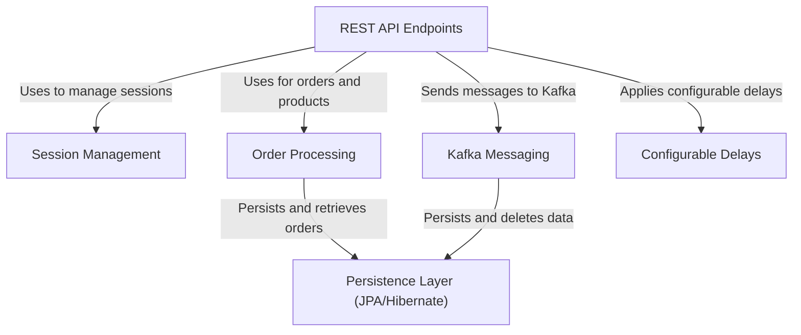

# Tutorial: practicalwork

This project, `practicalwork`, functions as a _mock_ or _stub_ backend application, primarily showcasing fundamental web service capabilities like **order processing** and **session management**. It includes a valuable feature for simulating real-world network latency or processing times through _configurable delays_ for API responses. The application also leverages **Kafka messaging** for efficient, asynchronous event handling, and all critical data, such as orders and processed messages, is permanently stored using a robust _JPA/Hibernate_ **persistence layer** that interacts with a PostgreSQL database.

## Visual Overview

## Chapters

1. [REST API Endpoints
](01_rest_api_endpoints_.md)
2. [Order Processing
](02_order_processing_.md)
3. [Session Management
](03_session_management_.md)
4. [Configurable Delays
](04_configurable_delays_.md)
5. [Kafka Messaging
](05_kafka_messaging_.md)
6. [Persistence Layer (JPA/Hibernate)
](06_persistence_layer__jpa_hibernate__.md)

---

Generated by [AI Codebase Knowledge Builder](https://github.com/The-Pocket/Tutorial-Codebase-Knowledge).