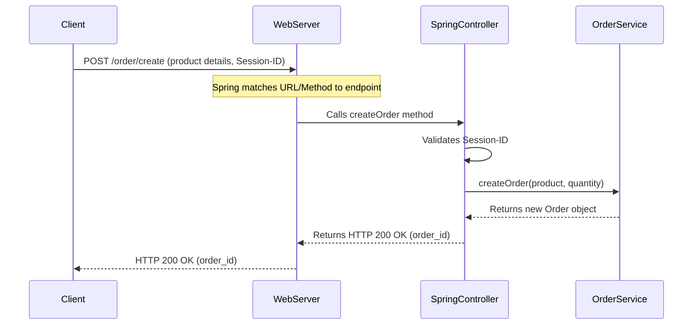

# Chapter 1: REST API Endpoints

Welcome to the `practicalwork` project tutorial! In this first chapter, we'll start with a fundamental concept that acts as the entry point for almost everything our application does: **REST API Endpoints**.

Imagine our application is a bustling office building. If you want to get something done, like placing an order or checking your account, you don't just walk in and shout. Instead, you'd go to a specific "reception desk" or "service counter" designed to handle your request.

In the world of software, these "reception desks" are called **REST API Endpoints**. They are specific addresses on the internet where our application listens for requests from other systems (like your web browser, a mobile app, or another computer program).

### Why do we need Endpoints?

The main problem endpoints solve is providing a structured and clear way for different computer systems to communicate. Without them, there would be no defined way to tell our application:
*   "Hey, I want to create a new order for a laptop!"
*   "Can you please tell me all the products you sell?"
*   "I want to create a new user session."

Each of these requests needs a unique address and a clear "intent" so our application knows exactly what to do. For instance, a common task in an e-commerce application, and one we'll focus on in `practicalwork`, is **creating an order**. To create an order, a customer's browser needs a specific endpoint to send that request to.

### Understanding the Basics

Let's break down the key ideas behind REST API Endpoints:

1.  **API (Application Programming Interface)**: Think of an API as a menu in a restaurant. It lists all the things you can order (the functionalities) and how to order them (the rules for interaction). Our application provides an API so other software knows how to "talk" to it.
2.  **REST (Representational State Transfer)**: This is a popular *style* or *set of rules* for building web services. It's like the etiquette for how servers and clients should communicate over the internet.
3.  **Endpoint**: This is the actual specific URL (Uniform Resource Locator) where a particular API function can be accessed. It's the "address" of a specific service or resource within our application.

### How to Interact with Endpoints

When you interact with an endpoint, you typically use:

*   **HTTP Method (the "verb")**: This tells the server *what kind of action* you want to perform. Common methods include:
    *   `GET`: Request data from the server (e.g., "GET me the list of products").
    *   `POST`: Send new data to the server to create something (e.g., "POST this new order").
    *   `PUT`: Send data to update an existing resource.
    *   `DELETE`: Ask the server to remove a resource.
*   **URL/Path (the "address")**: This is the specific address of the resource or action you're targeting. For example, `/order/create` or `/session/create`.

Let's use our example of **creating an order**. To do this, your browser (the "client") would send a `POST` request to our application's `/order/create` endpoint.

**Example of what a client sends (Request):**

```http
POST /order/create HTTP/1.1
Host: your-app-domain.com
Session-ID: some-unique-session-id-123 // Identifies your session
Content-Type: application/json

{
    "product_name": "Fancy Gadget",
    "quantity": 2
}
```
*   `POST`: The action we want to perform (create something).
*   `/order/create`: The specific address for creating orders.
*   `Session-ID`: A special identifier in the header, crucial for our app to know who you are.
*   `{"product_name": "Fancy Gadget", "quantity": 2}`: The details of the order, sent in the request body.

**Example of what our application sends back (Response):**

```http
HTTP/1.1 200 OK
Content-Type: application/json

{
    "order_id": "a1b2c3d4-e5f6-7890-1234-567890abcdef"
}
```
*   `200 OK`: A status code indicating the request was successful.
*   `{"order_id": ...}`: The unique identifier for the order that was just created.

### Endpoints in Our Code

In the `practicalwork` project, we use Spring Boot, a popular framework for building applications in Java. Spring Boot makes it very easy to define these endpoints using special annotations.

Let's look at a simplified example from our `src/main/java/BellSpring/controller/SpringController.java` file:

```java
// File: src/main/java/BellSpring/controller/SpringController.java

// ... imports and class definition ...

@RestController // Tells Spring that this class handles web requests
public class SpringController {

    // ... other services are injected here ...

    @PostMapping("/order/create") // This method handles POST requests to /order/create
    public ResponseEntity<?> createOrder(@RequestHeader("Session-ID") String sessionId,
                                             @RequestBody Map<String, Object> request) {
        // Here, the application processes the order creation logic
        // ... (details handled by other services) ...
        // Finally, it returns a response with the new order's ID
        return ResponseEntity.ok(Map.of("order_id", "some-generated-id"));
    }

    @GetMapping("/order/getProducts") // This method handles GET requests to /order/getProducts
    public ResponseEntity<?> getProducts(@RequestHeader("Session-ID") String sessionId) {
        // Here, the application retrieves and returns the list of products
        // ...
        return ResponseEntity.ok(Map.of("Laptop", 1200, "Mouse", 25));
    }
}
```
*   `@RestController`: This is a special tag for Spring Boot. It tells Spring, "Hey, this Java class is meant to expose functionalities over the web, usually as RESTful endpoints!"
*   `@PostMapping("/order/create")`: This is the key part! It links the `createOrder` Java method to `POST` requests sent to the `/order/create` path. When a request hits this path with a `POST` method, the `createOrder` method gets executed.
*   `@GetMapping("/order/getProducts")`: Similarly, this links the `getProducts` method to `GET` requests for `/order/getProducts`.

These annotations are what transform ordinary Java methods into publicly accessible "reception desks" for your application!

Let's look at another example from `src/main/java/BellSpring/controller/DelayController.java` to see a slightly different endpoint setup:

```java
// File: src/main/java/BellSpring/controller/DelayController.java

// ... imports and class definition ...

@RestController
@RequestMapping("/delay") // All endpoints in this class start with "/delay"
public class DelayController {

    // ... other services ...

    @GetMapping // Handles GET requests to /delay (because of the class-level @RequestMapping)
    public DelayConfig getDelays() {
        // This method fetches and returns the current delay configuration.
        return new DelayConfig(); // simplified
    }

    @PostMapping // Handles POST requests to /delay
    public ResponseEntity<String> updateDelays(@RequestBody DelayConfig newConfig) {
        // This method would update delay settings.
        return ResponseEntity.ok("Delays updated!");
    }
}
```
*   `@RequestMapping("/delay")`: When placed at the top of a controller class, this acts as a base path for all endpoints defined *inside* that class. So, any `@GetMapping` or `@PostMapping` inside `DelayController` automatically has `/delay` prefixed to its path.
*   `@GetMapping`: Because `@RequestMapping("/delay")` is present, this specific `@GetMapping` now corresponds to `GET /delay`.
*   `@PostMapping`: Similarly, this `@PostMapping` now corresponds to `POST /delay`.

### What Happens When You Call an Endpoint?

Let's trace the journey of a request when a client tries to **create an order** using the `/order/create` endpoint:

1.  **Client Sends Request**: Your web browser or a mobile app sends an `HTTP POST` request to `your-app-domain.com/order/create`, including the product details and your `Session-ID`.
2.  **Application's Web Server Receives**: Our `practicalwork` application, running on a server, receives this incoming request.
3.  **Endpoint Matching**: Spring Boot (the framework we use) looks at the incoming URL (`/order/create`) and the HTTP method (`POST`). It then finds the matching "reception desk" – which is the `createOrder` method within our `SpringController`.
4.  **Method Execution**: The `createOrder` method starts running.
    *   It first checks the `Session-ID` to ensure it's a valid and active user session (we'll learn more about this in [Session Management](03_session_management_.md)).
    *   Then, it extracts the `product_name` and `quantity` from the request body.
    *   It hands off the actual task of creating the order to another part of our application, called the `orderService`. (We'll explore this service in detail in [Order Processing](02_order_processing_.md)).
    *   The `orderService` performs the necessary steps, like saving the order details.
5.  **Response Sent Back**: Once the order is successfully created, the `createOrder` method prepares a response (e.g., the new `order_id`) and sends it back to the client.

Here's a simple diagram illustrating this flow:



### Diving into the Code Implementation

Let's look at the actual `createOrder` method in `src/main/java/BellSpring/controller/SpringController.java` with a bit more detail, referencing where other concepts fit in:

```java
// File: src/main/java/BellSpring/controller/SpringController.java

// ... inside SpringController class ...

    @PostMapping("/order/create")
    public ResponseEntity<?> createOrder(@RequestHeader("Session-ID") String sessionId,
                                             @RequestBody Map<String, Object> request) {
        // Optional: Apply configured delays if any (covered in [Configurable Delays](04_configurable_delays_.md))
        delayService.applyDelay("order.create");

        // Step 1: Validate the user's session using the SessionService
        if (!sessionService.isValidSession(sessionId)) { // See [Session Management](03_session_management_.md)
            return ResponseEntity.status(401).body("Unauthorized: Invalid session");
        }

        // Step 2: Extract product details from the request body
        String productName = (String) request.get("product_name");
        Integer quantity = Integer.valueOf(request.get("quantity").toString());

        // Step 3: Delegate the actual order creation to the OrderService
        // This is where the core business logic for orders happens (covered in [Order Processing](02_order_processing_.md))
        Order order = orderService.createOrder(sessionId, productName, quantity);

        // Step 4: Construct and return the successful response
        return ResponseEntity.ok(Map.of(
                "order_id", order.getId()
        ));
    }
```
*   `@RequestHeader("Session-ID") String sessionId`: This powerful annotation tells Spring to automatically find the `Session-ID` value within the incoming request's headers and make it available as a `String` variable named `sessionId` in our method. This is how we get the unique identifier for the user's session.
*   `@RequestBody Map<String, Object> request`: This annotation tells Spring to take the JSON data from the request's body (like `{"product_name": "Fancy Gadget", "quantity": 2}`) and convert it into a Java `Map`. This makes it easy for us to access the sent data.
*   `delayService.applyDelay("order.create")`: Before doing anything else, this line checks if we've configured any artificial delays for the "order.create" endpoint. This is useful for testing and will be covered in [Configurable Delays](04_configurable_delays_.md).
*   `sessionService.isValidSession(sessionId)`: Here, our endpoint uses another specialized "helper" (a `service`) called `sessionService` to verify if the provided `sessionId` is valid. We'll explore how sessions are managed in [Session Management](03_session_management_.md).
*   `orderService.createOrder(...)`: This is where the real magic of creating an order happens! The endpoint *delegates* this complex task to the `orderService`. The `orderService` handles the business logic, like calculating prices and saving data. You'll learn all about this in [Order Processing](02_order_processing_.md).
*   `ResponseEntity.ok(Map.of("order_id", order.getId()))`: This is how our method constructs the HTTP response. `ResponseEntity.ok()` indicates a successful `HTTP 200 OK` status, and `Map.of(...)` creates a simple structure (which Spring converts to JSON) containing the `order_id` to send back to the client.

### Conclusion

In this chapter, we've explored the concept of REST API Endpoints, understanding them as the "reception desks" of our application. We've seen how they provide specific addresses and methods for clients to interact with our `practicalwork` project, using `GET` and `POST` requests to perform actions like creating orders or fetching product lists. We also looked at how Spring Boot annotations (`@RestController`, `@PostMapping`, `@GetMapping`, `@RequestMapping`) turn ordinary Java methods into these powerful web entry points.

Next, we'll dive deeper into one of the core functionalities managed by these endpoints: [Order Processing](02_order_processing_.md). We'll uncover how our application takes a request to create an order and makes it a reality behind the scenes.

---

<sub><sup>Generated by [AI Codebase Knowledge Builder](https://github.com/The-Pocket/Tutorial-Codebase-Knowledge).</sup></sub> <sub><sup>**References**: [[1]](https://github.com/avgystin/practicalwork/blob/71096d4adfc15ec4fc4942c8c3cefe26364d3a19/src/main/java/BellSpring/controller/DelayController.java), [[2]](https://github.com/avgystin/practicalwork/blob/71096d4adfc15ec4fc4942c8c3cefe26364d3a19/src/main/java/BellSpring/controller/SpringController.java)</sup></sub>