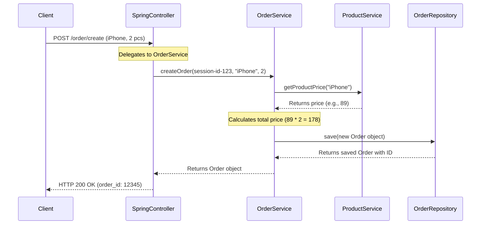

# Chapter 2: Order Processing

Welcome back to the `practicalwork` project tutorial! In the [previous chapter](01_rest_api_endpoints_.md), we learned about **REST API Endpoints** – the "reception desks" that our application uses to communicate with the outside world. We saw how a client (like your web browser) sends a `POST` request to an endpoint like `/order/create` when you want to buy something.

But what happens *after* that request arrives at the endpoint? How does our application actually understand what you want, figure out prices, and remember your purchase? That's exactly what **Order Processing** is all about!

### What is Order Processing?

Imagine our `practicalwork` application is a small, bustling online shop. When a customer wants to buy a "Fancy Gadget," they don't just send money to a general address. They need a system that:

1.  **Knows what products are available** and how much they cost.
2.  **Takes the customer's request** (e.g., "I want 2 'Fancy Gadgets'").
3.  **Calculates the total price**.
4.  **Records the purchase** as an official "order" or "receipt."
5.  **Allows the customer to look up** their past orders.

This entire sequence of steps, from receiving a customer's intention to buy to successfully recording it, is what we call **Order Processing**. It's the core business logic that makes our online shop function.

### Key Players in Order Processing

To handle all these tasks efficiently, our `practicalwork` project divides the responsibilities among a few specialized components:

| Component        | Role (What it does)                                           | Analogy                                   |
| :--------------- | :------------------------------------------------------------ | :---------------------------------------- |
| `ProductService` | Keeps track of all available products and their current prices. | The shop's **inventory manager** and **price list** |
| `OrderService`   | Handles the creation of new orders, calculates costs, and fetches existing orders. | The shop's **cashier** and **record keeper** |
| `Order` Data Model | Represents a single customer purchase, like a detailed receipt. | The actual **receipt** or **invoice**     |

Let's look at how these pieces work together.

### The `Order` Data Model: Your Digital Receipt

First, let's understand what an `Order` actually *is* in our application. When you buy something, you get a receipt, right? That receipt has details like the items you bought, their prices, and the total cost.

Our `Order` data model is the digital version of that receipt. It's a special structure that holds all the information about a customer's purchase.

Here's a simplified look at the `Order` model in our code (`src/main/java/BellSpring/model/Order.java`):

```java
// File: src/main/java/BellSpring/model/Order.java

// ... imports and class definition ...

public class Order {

    private Long id;              // A unique number for this specific order
    private String orderUuid;     // Another unique identifier (like a long receipt number)
    private String sessionId;     // Who made the order (linked to their session)
    private String productName;   // What product was bought
    private Integer quantity;     // How many of that product
    private Integer unitPrice;    // Price of one item when bought
    private Integer totalPrice;   // Total cost for all items in this order
    private LocalDateTime createdAt; // When the order was made

    // ... other methods like getters and setters ...
}
```
*   Each variable here (like `productName`, `quantity`, `totalPrice`) is a piece of information that describes one particular order.
*   This `Order` object is what gets created and saved when a customer makes a purchase, acting as a permanent record.

### `ProductService`: Knowing What's in Stock and Its Price

Before we can create an order, we need to know what products we sell and their prices. That's the job of the `ProductService`. Think of it as the shop's catalog and price list. It doesn't handle orders directly; it just provides information about products.

Here's a look at `src/main/java/BellSpring/service/ProductService.java`:

```java
// File: src/main/java/BellSpring/service/ProductService.java

// ... imports and class definition ...

@Service
public class ProductService {

    // This map holds our products and their prices (e.g., "MacBook" -> 1 unit price)
    private static final Map<String, Integer> products = new LinkedHashMap<>();

    public ProductService() {
        initializeProducts(); // Populates the 'products' map
    }

    private void initializeProducts() {
        products.put("MacBook", 1);
        products.put("iPhone", 89);
        // ... more products ...
    }

    public static Map<String, Integer> getAllProducts() {
        // Returns a list of all products and their prices
        return Collections.unmodifiableMap(products);
    }

    public Integer getProductPrice(String productName) {
        // Gives us the price for a specific product
        return products.get(productName);
    }
}
```
*   The `products` map is like our shop's main inventory list, mapping product names to their prices.
*   `getAllProducts()` is used by endpoints like `/order/getProducts` (which we saw in Chapter 1) to show customers what's available.
*   `getProductPrice(String productName)` is crucial for `OrderService` to find out how much an item costs before calculating the total.

### `OrderService`: The Cashier and Record Keeper

The `OrderService` is the heart of our order processing. It's the component that actually handles the steps of creating a new order, calculating its total cost, and working with the `Order` data model.

Let's trace how the `OrderService` helps when a customer wants to create an order. Remember from [Chapter 1: REST API Endpoints](01_rest_api_endpoints_.md), the client sends a `POST` request to `/order/create` with details like `product_name` and `quantity`.

Here's the core method in `src/main/java/BellSpring/service/OrderService.java` that handles creating an order:

```java
// File: src/main/java/BellSpring/service/OrderService.java

// ... imports and class definition ...

@Service
@RequiredArgsConstructor
public class OrderService {

    private final OrderRepository orderRepository; // Helps save and retrieve orders
    private final ProductService productService;   // To get product prices

    /**
     * Creates an order for the specified product and quantity.
     */
    public Order createOrder(String sessionId, String productName, Integer quantity) {
        // 1. Get the price of the product from ProductService
        Integer unitPrice = productService.getProductPrice(productName);
        if (unitPrice == null) {
            throw new IllegalArgumentException("Product not found: " + productName);
        }

        // 2. Calculate the total cost
        Integer totalPrice = unitPrice * quantity;

        // 3. Create a new Order object (our digital receipt)
        Order order = new Order();
        order.setSessionId(sessionId);
        order.setProductName(productName);
        order.setQuantity(quantity);
        order.setUnitPrice(unitPrice);
        order.setTotalPrice(totalPrice);

        // 4. Save the order to our database using OrderRepository
        return orderRepository.save(order);
    }

    // ... other methods like getOrderByIdWithProductValidation ...
}
```
*   `orderRepository`: This is a special helper that `OrderService` uses to actually save the `Order` object into a database, so it's permanently recorded. (We'll learn more about this in [Persistence Layer (JPA/Hibernate)](06_persistence_layer__jpa_hibernate__.md)).
*   `productService`: As we discussed, `OrderService` uses `ProductService` to look up the price of an item.
*   `createOrder()`: This method takes all the necessary details (who, what, how many), performs the calculations, creates the `Order` object, and then saves it.

### How it All Fits Together: Creating an Order

Let's put it all together and see the journey of a request to create an order, from the client's perspective to the internal processing:

**Use Case: A customer wants to order 2 "iPhone" products.**

1.  **Client Sends Request**: The customer's browser sends a `POST` request to `/order/create`.

    ```http
    POST /order/create HTTP/1.1
    Host: your-app-domain.com
    Session-ID: user-session-123 // Identifies the customer
    Content-Type: application/json

    {
        "product_name": "iPhone",
        "quantity": 2
    }
    ```

2.  **`SpringController` Receives**: Our `SpringController` (the endpoint from Chapter 1) receives this request. It first validates the `Session-ID` (as we'll see in [Session Management](03_session_management_.md)). Then, it sees that the actual job of creating the order belongs to the `OrderService`.

    ```java
    // File: src/main/java/BellSpring/controller/SpringController.java

    // ... inside SpringController class ...

    @PostMapping("/order/create")
    public ResponseEntity<?> createOrder(@RequestHeader("Session-ID") String sessionId,
                                             @RequestBody Map<String, Object> request) {
        // ... session validation and extracting product/quantity ...

        // This is where the magic happens! We ask OrderService to create the order.
        Order order = orderService.createOrder(sessionId, productName, quantity);

        // ... return response ...
        return ResponseEntity.ok(Map.of("order_id", order.getId()));
    }
    ```
    *   The `SpringController` *delegates* the complex task of order creation to `orderService`. It doesn't do the heavy lifting itself.

3.  **`OrderService` Processes**: The `orderService.createOrder()` method starts working:
    *   It asks `ProductService` for the price of "iPhone".
    *   `ProductService` replies: "iPhone costs 89 units."
    *   `OrderService` calculates: Total price = 89 * 2 = 178.
    *   It then creates a new `Order` object with all these details.
    *   Finally, it tells the `OrderRepository` to save this `Order` object into the database.

4.  **Application Sends Response**: The `SpringController` receives the newly created `Order` object from `OrderService` and sends back a success message to the client, including the unique ID of the new order.

    ```http
    HTTP/1.1 200 OK
    Content-Type: application/json

    {
        "order_id": "12345" // The unique ID of the newly created order
    }
    ```

Here's a sequence diagram to visualize this flow:



### Retrieving Past Orders

Our `OrderService` can also help retrieve orders. For example, a customer might want to check the details of a specific purchase.

The `SpringController` has an endpoint `/order/getOrder` that uses `OrderService` to fetch an order by its ID, with an added check for the product name.

```java
// File: src/main/java/BellSpring/controller/SpringController.java

// ... inside SpringController class ...

    @GetMapping("/order/getOrder")
    public ResponseEntity<?> getOrder(@RequestParam Long order_id,
                                      @RequestParam String product_name,
                                      @RequestHeader("Session-ID") String sessionId) {
        // ... session validation ...

        try {
            // Asks OrderService to find the order and validate its product name
            Order order = orderService.getOrderByIdWithProductValidation(order_id, product_name);

            // Returns the details of the found order
            return ResponseEntity.ok(Map.of(
                    "order_id", order.getId(),
                    "product_name", order.getProductName(),
                    "quantity", order.getQuantity(),
                    "total_price", order.getTotalPrice()
            ));
        } catch (IllegalArgumentException e) {
            // If order not found or product name doesn't match
            return ResponseEntity.badRequest().body(e.getMessage());
        }
    }
```
*   `getOrderByIdWithProductValidation` in `OrderService` will look up the order in the database and then verify if the product name matches what was provided in the request, preventing accidental (or malicious) access to wrong order details.

This shows how the `OrderService` is not just for creating orders, but also for managing and retrieving them, acting as the central hub for all order-related business logic.

### Conclusion

In this chapter, we've explored the crucial concept of **Order Processing**. We've seen how `ProductService` keeps our product catalog and prices, how the `OrderService` acts as the shop's cashier and record keeper to create and manage customer purchases, and how the `Order` data model represents those purchases as digital receipts. We also traced the journey of an order creation request, from the client to the internal services.

This core functionality relies heavily on who is making the order – the customer's identity and state. Next, we'll dive into how our application manages this aspect by understanding [Session Management](03_session_management_.md).

---

<sub><sup>Generated by [AI Codebase Knowledge Builder](https://github.com/The-Pocket/Tutorial-Codebase-Knowledge).</sup></sub> <sub><sup>**References**: [[1]](https://github.com/avgystin/practicalwork/blob/71096d4adfc15ec4fc4942c8c3cefe26364d3a19/src/main/java/BellSpring/controller/SpringController.java), [[2]](https://github.com/avgystin/practicalwork/blob/71096d4adfc15ec4fc4942c8c3cefe26364d3a19/src/main/java/BellSpring/model/Order.java), [[3]](https://github.com/avgystin/practicalwork/blob/71096d4adfc15ec4fc4942c8c3cefe26364d3a19/src/main/java/BellSpring/repository/OrderRepository.java), [[4]](https://github.com/avgystin/practicalwork/blob/71096d4adfc15ec4fc4942c8c3cefe26364d3a19/src/main/java/BellSpring/service/OrderService.java), [[5]](https://github.com/avgystin/practicalwork/blob/71096d4adfc15ec4fc4942c8c3cefe26364d3a19/src/main/java/BellSpring/service/ProductService.java)</sup></sub>