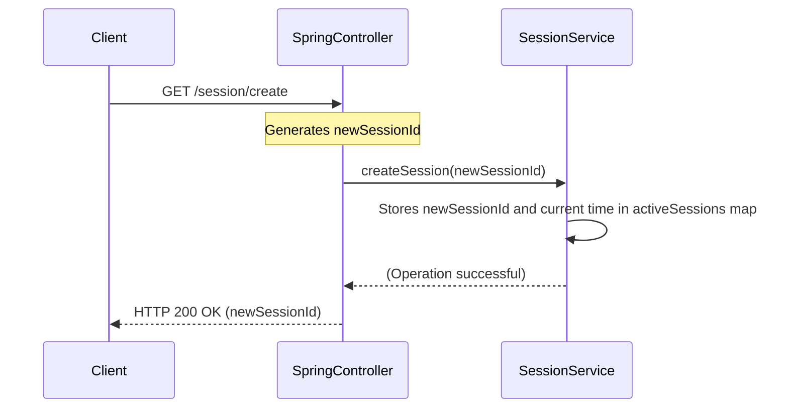

# Chapter 3: Session Management

Welcome back to the `practicalwork` project tutorial! In the [previous chapter](02_order_processing_.md), we explored **Order Processing** and how our application handles creating and managing customer orders. We saw that when an order is created, it's associated with a `sessionId`. But what exactly *is* a session, and why is it important?

This chapter is all about **Session Management**, which is like giving a user a temporary "ticket" or "ID card" when they first interact with our application. This "ticket" allows the application to remember who the user is for a short period without them having to log in or provide their identity repeatedly.

### Why Do We Need Session Management?

Imagine you're shopping online. You add an item to your cart, then browse for another, and finally go to checkout. If the website didn't remember you, you'd have to identify yourself (perhaps by logging in) at *every single step*. That would be incredibly annoying and make online shopping impossible!

The problem **Session Management** solves is maintaining a user's *context* or *state* across multiple individual requests. HTTP, the language of the web, is "stateless," meaning each request is typically independent. Without sessions, our application wouldn't know that the "add to cart" request and the "checkout" request came from the same person.

With session management, once you get your "ticket" (a **Session ID**), you present it with every request, and the application instantly recognizes you.

### Key Concepts of Session Management

Let's break down the core ideas:

1.  **Session**: Think of this as a temporary, unique interaction period between a user and our application. It starts when a user first connects and ends after a certain period of inactivity or when they explicitly log out.
2.  **Session ID**: This is a unique string of characters (like a special code on your "ticket") that identifies a specific session. When you first visit our app, it generates a new, random Session ID for you. You then send this ID back with every request, telling the app, "It's me, the one with this ID!"
3.  **Expiration**: Just like real tickets, sessions don't last forever. For security and resource management, sessions have an expiration time. If you leave your online shopping cart open for too long, the website might "forget" you and ask you to log in again. Our `SessionService` is responsible for checking if a session is still valid or if its "ticket" has expired.
4.  **`SessionService`**: This is the dedicated part of our application that acts like a "clerk" at the ticket booth. Its job is to:
    *   Issue new Session IDs (`createSession`).
    *   Check if a Session ID is still valid (`isValidSession`).
    *   Take back or invalidate Session IDs (`deleteSession`).

### How to Use Session Management: Our API Endpoints

Our `practicalwork` application exposes several [REST API Endpoints](01_rest_api_endpoints_.md) that interact with the `SessionService`. These endpoints allow clients to create, use, and manage their sessions.

Let's look at the relevant parts of `src/main/java/BellSpring/controller/SpringController.java`.

#### 1. Creating a Session

A user first needs a Session ID. This is typically done through a dedicated endpoint.

**Endpoint:** `GET /session/create`

**What it does:** Generates a new, unique Session ID and returns it to the client.

**Example Code:**

```java
// File: src/main/java/BellSpring/controller/SpringController.java

// ... inside SpringController class ...

    @GetMapping("/session/create")
    public ResponseEntity<Map<String, String>> createSession() {
        // Generates a random unique ID for the session
        String sessionId = UUID.randomUUID().toString();
        // Tells the SessionService to start tracking this new session
        sessionService.createSession(sessionId);

        // Returns the new session ID to the client
        return ResponseEntity.ok(Map.of("session_id", sessionId));
    }
```

*   `UUID.randomUUID().toString()`: This generates a very long, unique string that will serve as our Session ID.
*   `sessionService.createSession(sessionId)`: This calls our `SessionService` to register this new Session ID and mark it as active.
*   `ResponseEntity.ok(Map.of("session_id", sessionId))`: The application sends back the newly created Session ID to the client, so the client can use it for future requests.

**Example Request:**

```http
GET /session/create HTTP/1.1
Host: your-app-domain.com
```

**Example Response:**

```http
HTTP/1.1 200 OK
Content-Type: application/json

{
    "session_id": "a1b2c3d4-e5f6-4789-abcd-ef0123456789"
}
```
The client receives this `session_id` and is expected to include it in all subsequent requests using the `Session-ID` header.

#### 2. Validating a Session (Used by Other Endpoints)

Once a client has a Session ID, it will send it with every request that requires user context (like creating an order or getting products). Our `SpringController` then uses `sessionService.isValidSession()` to check if the provided Session ID is still active and hasn't expired.

**Example Code (from `createOrder`):**

```java
// File: src/main/java/BellSpring/controller/SpringController.java

// ... inside createOrder method ...

    @PostMapping("/order/create")
    public ResponseEntity<?> createOrder(@RequestHeader("Session-ID") String sessionId,
                                             @RequestBody Map<String, Object> request) {
        // Important: First, check if the session is valid!
        if (!sessionService.isValidSession(sessionId)) { // <-- Here!
            // If not valid, send an unauthorized error
            return ResponseEntity.status(401).body("Unauthorized: Invalid session");
        }
        // ... If valid, proceed with creating the order (see Chapter 2) ...
        // Order order = orderService.createOrder(sessionId, productName, quantity);
        // return ResponseEntity.ok(Map.of("order_id", order.getId()));
        return null; // Simplified for example
    }
```
*   `@RequestHeader("Session-ID") String sessionId`: This annotation captures the `Session-ID` value from the incoming request's HTTP headers.
*   `sessionService.isValidSession(sessionId)`: This is the critical call to our `SessionService`. If it returns `false`, it means the "ticket" is no longer valid, and the request is rejected with a `401 Unauthorized` status.
*   Only if the session is valid does the application proceed to process the order using the [Order Processing](02_order_processing_.md) logic.

#### 3. Deleting a Session

When a user logs out or decides they are done, their session should be explicitly deleted.

**Endpoint:** `DELETE /session/delete`

**What it does:** Invalidates and removes the specified Session ID.

**Example Code:**

```java
// File: src/main/java/BellSpring/controller/SpringController.java

// ... inside SpringController class ...

    @DeleteMapping("/session/delete")
    public ResponseEntity<?> deleteSession(@RequestHeader("Session-ID") String sessionId) {
        // First, check if the session is even valid before trying to delete
        if (!sessionService.isValidSession(sessionId)) {
            return ResponseEntity.status(401).body("Unauthorized: Invalid session");
        }
        // Ask the SessionService to delete the session
        boolean deleted = sessionService.deleteSession(sessionId);

        if (deleted) {
            return ResponseEntity.ok("Session deleted successfully");
        } else {
            // Should ideally not happen if isValidSession passed, but good for robustness
            return ResponseEntity.status(404).body("Session not found");
        }
    }
```

**Example Request:**

```http
DELETE /session/delete HTTP/1.1
Host: your-app-domain.com
Session-ID: a1b2c3d4-e5f6-4789-abcd-ef0123456789
```

**Example Response:**

```http
HTTP/1.1 200 OK

Session deleted successfully
```

#### 4. Checking a Session (for demonstration)

For debugging or specific client needs, there might be an endpoint to explicitly check a session's validity.

**Endpoint:** `GET /order/Check`

**What it does:** Checks if a given session ID is currently valid.

**Example Code:**

```java
// File: src/main/java/BellSpring/controller/SpringController.java

// ... inside SpringController class ...

    @GetMapping("/order/Check")
    public ResponseEntity<?> checkSession(@RequestParam String session_id) {
        // Directly uses isValidSession to check
        boolean isValid = sessionService.isValidSession(session_id);

        return ResponseEntity.ok(Map.of(
                "session_id", session_id,
                "is_valid", isValid,
                "message", isValid ? "Session is active" : "Session is invalid or deleted"
        ));
    }
```
*   `@RequestParam String session_id`: The session ID is passed as a query parameter in the URL.

### Inside the `SessionService`: How it Works

Now, let's peek behind the curtain and see how our `SessionService` manages these "tickets" in `src/main/java/BellSpring/service/SessionService.java`.

The `SessionService` needs to remember all active Session IDs and when they were created so it can check for expiration.

**Main Components:**

1.  **`activeSessions`**: This is a special kind of map (a `ConcurrentHashMap`) that stores our active sessions. The "key" is the `Session ID` (the unique string), and the "value" is the `timestamp` (a number representing when the session was created).
2.  **`SESSION_TIMEOUT_MS`**: This is a constant value that defines how long a session can remain active without activity (e.g., 30 minutes).

**Let's trace creating a session:**



Now let's look at the actual code:

```java
// File: src/main/java/BellSpring/service/SessionService.java

package BellSpring.service;

import org.springframework.stereotype.Service;
import java.util.Map;
import java.util.concurrent.ConcurrentHashMap; // A thread-safe map

@Service
public class SessionService {

    // This map stores active session IDs and their creation timestamps
    private final Map<String, Long> activeSessions = new ConcurrentHashMap<>();
    // Sessions expire after 30 minutes of inactivity
    private static final long SESSION_TIMEOUT_MS = 30 * 60 * 1000;

    /**
     * Creates a new session.
     * It simply records the session ID and the current time.
     */
    public void createSession(String sessionId) {
        activeSessions.put(sessionId, System.currentTimeMillis());
    }

    /**
     * Checks if a session ID is valid and hasn't expired.
     */
    public boolean isValidSession(String sessionId) {
        // 1. Check if the session ID exists in our map
        if (sessionId == null || !activeSessions.containsKey(sessionId)) {
            return false; // Not found, so not valid
        }

        // 2. Get the session's creation time
        Long creationTime = activeSessions.get(sessionId);
        if (creationTime == null) {
            return false; // Should not happen if containsKey was true, but good check
        }

        // 3. Check if the session has expired
        if (System.currentTimeMillis() - creationTime > SESSION_TIMEOUT_MS) {
            // If expired, remove it from the map to clean up
            activeSessions.remove(sessionId);
            return false; // It's expired, so not valid
        }

        // If it exists and hasn't expired, it's valid!
        return true;
    }

    /**
     * Deletes a session.
     * Simply removes it from the map.
     */
    public boolean deleteSession(String sessionId) {
        if (sessionId == null) {
            return false;
        }
        // remove() returns the value that was removed, or null if not found
        return activeSessions.remove(sessionId) != null;
    }

    // invalidateSession is an alternative name for deleteSession, essentially the same logic here
    public void invalidateSession(String sessionId) {
        activeSessions.remove(sessionId);
    }
}
```

*   **`ConcurrentHashMap`**: This is a special type of `Map` in Java that is safe to use when multiple parts of your application might try to read or write to it at the same time. This is important for web applications that handle many users concurrently.
*   **`createSession`**: When called, it simply stores the `sessionId` and the exact `System.currentTimeMillis()` (which gives the current time in milliseconds since 1970) into the `activeSessions` map.
*   **`isValidSession`**: This is the most complex part. It first checks if the `sessionId` is even in our `activeSessions` map. If it is, it retrieves the `creationTime`. Then, it compares the current time (`System.currentTimeMillis()`) with the `creationTime`. If the difference is greater than `SESSION_TIMEOUT_MS` (30 minutes), the session is considered expired, it's removed from the map, and the method returns `false`. Otherwise, it returns `true`.
*   **`deleteSession` / `invalidateSession`**: These methods simply remove the `sessionId` from the `activeSessions` map, effectively ending that session immediately, regardless of its expiration time.

### Conclusion

In this chapter, we've demystified **Session Management**. We've learned that sessions provide a way for our `practicalwork` application to remember individual users across multiple requests using a unique **Session ID**. The `SessionService` acts as the gatekeeper, issuing these IDs, validating their authenticity and expiration, and revoking them when no longer needed. This crucial abstraction ensures that our application can maintain user context, making interactions seamless and secure.

Next, we'll explore how our application can introduce [Configurable Delays](04_configurable_delays_.md) into its operations, which is useful for testing and simulating real-world network conditions.

---

<sub><sup>Generated by [AI Codebase Knowledge Builder](https://github.com/The-Pocket/Tutorial-Codebase-Knowledge).</sup></sub> <sub><sup>**References**: [[1]](https://github.com/avgystin/practicalwork/blob/71096d4adfc15ec4fc4942c8c3cefe26364d3a19/src/main/java/BellSpring/controller/SpringController.java), [[2]](https://github.com/avgystin/practicalwork/blob/71096d4adfc15ec4fc4942c8c3cefe26364d3a19/src/main/java/BellSpring/service/SessionService.java)</sup></sub>